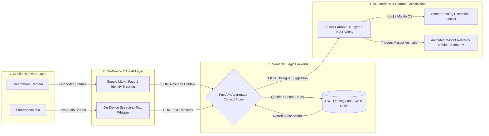

# Semantic Dialogue Assistant for Social Communication Training in Autism

## Project Idea

The project titled **“Semantic Dialogue Assistant for Social Communication Training in Autism”** is an application-based assistive system designed to support children with Autism Spectrum Disorder (ASD) in improving their real-time social communication skills.

Children with ASD often face difficulty in understanding social context, identifying the role of the person they are interacting with (such as teacher, parent, or peer), and responding appropriately during live conversations. Most existing assistive technologies focus on offline learning, text-based exercises, or isolated simulations, which do not effectively help in real-world, real-time interactions.

This project aims to address this gap by developing a system that provides real-time, context-aware conversational guidance using multimodal inputs such as facial cues and speech.

The system captures input through a camera and microphone. The perception module processes these inputs by detecting faces and identifying social roles using computer vision techniques, while also converting spoken language (Tamil) into text using speech recognition models. This allows the system to understand who the user is interacting with and what is being said.

The processed information is then passed to a semantic reasoning module, which uses an ontology-based approach (OWL – Web Ontology Language) to model social roles, contexts, and interaction rules. SWRL (Semantic Web Rule Language) rules are applied to ensure that the system generates responses that are logically correct, socially appropriate, and safe. This rule-based reasoning ensures explainability and prevents unpredictable outputs.

A dialogue engine then generates suitable conversational suggestions based on the inferred context. Unlike generic AI systems, this project focuses on controlled and context-aware responses rather than open-ended generation.

The output is presented through a cartoon-based user interface, which provides simple and visual guidance to the user. This design reduces cognitive load and makes the system more accessible and engaging for children with ASD.

The system is intended to run on edge devices such as laptops or mobile devices to ensure low latency and maintain user privacy, as sensitive data like facial input and speech are processed locally.

Overall, the project integrates multiple domains including computer vision, speech processing, semantic web technologies, and human-computer interaction to create a unified assistive tool for real-time social communication training.

Currently, the project is in the design and planning phase, where the problem has been defined, requirements have been captured, and the system architecture has been designed. Implementation of individual modules and integration will be carried out in the next phase.

## System Architecture

