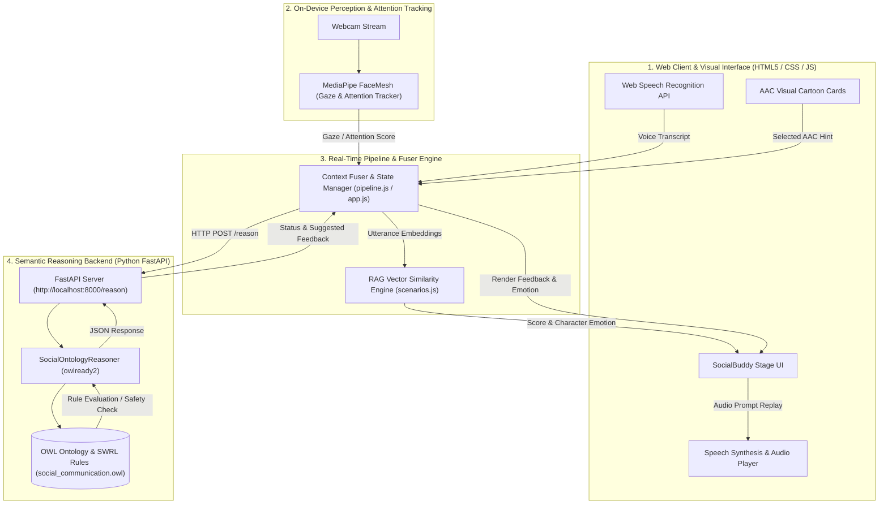

# SocialBuddy: Semantic Dialogue Assistant for Social Communication Training in Autism

[](https://www.python.org/)
[](https://fastapi.tiangolo.com/)
[](https://owlready2.readthedocs.io/)
[](https://developers.google.com/mediapipe)

**SocialBuddy** (Semantic Dialogue Assistant) is an interactive, application-based assistive platform designed to support children with Autism Spectrum Disorder (ASD) in developing real-time social communication skills.

Children with ASD often encounter challenges in recognizing social contexts, understanding the role of their interlocutor (e.g., Teacher, Parent, Friend, or Stranger), and formulating appropriate verbal responses. **SocialBuddy** bridges this gap by combining real-time multimodal perception, ontology-based semantic web reasoning (OWL/SWRL), RAG vector similarity matching, visual AAC (Augmentative and Alternative Communication) cards, and eye-contact attention tracking.

---

## 🌟 Key Features

- 🎭 **Interactive Social Scenarios**: Real-time practice modules tailored for key social contexts:
  - 🏫 **Teacher**: Classroom decorum and formal respect.
  - 🏠 **Parent**: Honesty, mistake handling, and sincere apologies.
  - 🛝 **Friend**: Sharing, turn-taking, and polite requests.
  - 🛑 **Stranger**: Safety rules, lure refusal, and boundary protection.
- 🧠 **OWL Ontology & SWRL Reasoning Backend**: Powered by FastAPI and `owlready2` to evaluate utterances against formal ontology social rules (`social_communication.owl`), checking safety violations, politeness, and contextual appropriateness with full explainability.
- 👁️ **Live Attention & Eye-Contact Tracking**: Utilizes MediaPipe FaceMesh in the browser to track facial landmarks, detect gaze alignment, and estimate user engagement in real time.
- 🎨 **Visual AAC Cartoon Hint Cards**: Interactive visual cards with animated icons allowing non-verbal or speech-impaired children to quickly select appropriate responses.
- 🎙️ **Speech-to-Text & Text-to-Speech**: Speech recognition for audio input and dynamic speech synthesis to replay character dialogs and prompt recordings.
- 🔍 **RAG Vector Similarity Engine**: Semantic vector matching to compute similarity scores, trigger character emotion state changes (e.g., Happy, Neutral, Concerned), and deliver feedback.
- ⚡ **Real-Time Visual Pipeline Visualizer**: Integrated diagnostic UI (`pipeline.js`) tracing the end-to-end data lifecycle: `Perception Input` ➔ `Semantic Fuser` ➔ `OWL Reasoner` ➔ `RAG Matcher` ➔ `Feedback Rendering`.
- 🔄 **Hybrid Architecture**: Runs seamless client-side scenario evaluation as a fallback if the FastAPI Python backend is offline.

---

## 🏗️ System Architecture


```mermaid
flowchart TD
    subgraph Client["1. Web Client & Visual Interface (HTML5 / CSS / JS)"]
        UI["SocialBuddy Stage UI"]
        AAC["AAC Visual Cartoon Cards"]
        TTS["Speech Synthesis & Audio Player"]
        STT["Web Speech Recognition API"]
    end

    subgraph Perception["2. On-Device Perception & Attention Tracking"]
        Cam["Webcam Stream"]
        FaceMesh["MediaPipe FaceMesh (Gaze & Attention Tracker)"]
    end

    subgraph Pipeline["3. Real-Time Pipeline & Fuser Engine"]
        Fuser["Context Fuser & State Manager (pipeline.js / app.js)"]
        RAG["RAG Vector Similarity Engine (scenarios.js)"]
    end

    subgraph Backend["4. Semantic Reasoning Backend (Python FastAPI)"]
        API["FastAPI Server (http://localhost:8000/reason)"]
        Reasoner["SocialOntologyReasoner (owlready2)"]
        OWL[("OWL Ontology & SWRL Rules (social_communication.owl)")]
    end

    Cam --> FaceMesh
    FaceMesh -- "Gaze / Attention Score" --> Fuser
    STT -- "Voice Transcript" --> Fuser
    AAC -- "Selected AAC Hint" --> Fuser

    Fuser -- "HTTP POST /reason" --> API
    API --> Reasoner
    Reasoner --> OWL
    OWL -- "Rule Evaluation / Safety Check" --> Reasoner
    Reasoner -- "JSON Response" --> API
    API -- "Status & Suggested Feedback" --> Fuser

    Fuser -- "Utterance Embeddings" --> RAG
    RAG -- "Score & Character Emotion" --> UI
    Fuser -- "Render Feedback & Emotion" --> UI
    UI -- "Audio Prompt Replay" --> TTS
```

---

## 📁 Repository Structure

```
Dialogue-Assistant/
├── index.html                    # Main web application UI layout
├── style.css                     # Responsive design system, glassmorphism & animations
├── app.js                        # Primary application controller & event handlers
├── pipeline.js                   # Visual diagnostic pipeline tracker & state visualizer
├── scenarios.js                  # Scenario definitions, visual hints, & RAG vector DB
├── attention.js                  # MediaPipe FaceMesh eye contact & attention engine
├── characters.js                 # Avatar rendering & character emotion manager
├── requirements.txt              # Python dependencies for the reasoning backend
├── .gitignore                    # Git exclusion rules
├── reasoning/
│   ├── api.py                    # FastAPI REST server serving /reason and /health endpoints
│   ├── reasoner.py               # SocialOntologyReasoner rule checking engine
│   └── social_communication.owl # Web Ontology Language (OWL) knowledge base
├── docs/                         # Project documentation and architectural assets
├── perception/                   # Perception module documentation
├── dialogue/                     # Dialogue engine reference materials
└── ui/                           # UI component assets & references
```

---

## 🚀 Quick Start Guide

### Prerequisites

- **Browser**: Modern web browser (Chrome, Edge, Firefox) with Web Speech API and Camera support.
- **Python**: Python 3.9+ (for running the OWL Semantic Reasoning backend).

---

### Step 1: Start the Python Semantic Reasoning Backend

1. Navigate to the `reasoning` folder and install dependencies:
   ```bash
   cd reasoning
   pip install -r ../requirements.txt
   ```
2. Start the FastAPI Uvicorn server:
   ```bash
   python api.py
   ```
   The API will start running at `http://localhost:8000`. You can test it by visiting:
   - Health Check: `http://localhost:8000/health`
   - Interactive Docs: `http://localhost:8000/docs`

---

### Step 2: Launch the Web Application

1. Open a new terminal tab/window in the project root directory (`Dialogue-Assistant`).
2. Serve the static web files using any HTTP server:
   - **Using Node.js**:
     ```bash
     npx serve .
     ```
   - **Using Python**:
     ```bash
     python -m http.server 3000
     ```
3. Open `http://localhost:3000` (or `http://localhost:5000` depending on your server) in your browser.
4. Allow camera and microphone permissions when prompted to enable live attention tracking and voice input.

---

## 🧪 Testing the Application

1. **Select a Social Context**: Choose one of the 4 scenario cards (**Teacher**, **Parent**, **Friend**, or **Stranger**).
2. **Eye Contact & Attention**: Ensure your face is visible in the camera view; the system monitors gaze direction and displays real-time attention status.
3. **Respond**:
   - **Voice**: Click the **Microphone** button and speak your response.
   - **AAC Cards**: Click any of the **Visual Cartoon AAC Hint Cards** for immediate interaction.
   - **Text Input**: Type an answer directly into the response field.
4. **Observe Semantic Feedback**:
   - Review rule evaluations, decorum checks, safety alerts, score updates, and character emotion state changes.
   - Expand the **Pipeline Diagnostics Bar** to inspect step-by-step data processing.

---

## 📜 License

This project is developed for educational, research, and assistive technology advancement purposes in social communication training for Autism Spectrum Disorder (ASD).
